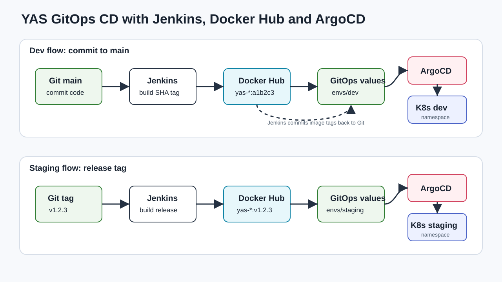

# ArgoCD handle dev and staging

## Goal

The advanced 2-point task is implemented with GitOps:

1. Jenkins builds Docker images and pushes them to Docker Hub.
2. Jenkins updates GitOps image tags in Git.
3. ArgoCD automatically syncs `dev` and `staging` from Git to Kubernetes.

## Environments

- `dev`: updated from `main` commits, image tag is the short commit SHA.
- `staging`: updated from release tags such as `v1.2.3`.

## Protected main workflow

Because `main` is protected, the GitOps files are committed on a feature branch
and merged by pull request. For screenshots before merge, ArgoCD can point
`targetRevision` to the feature branch; after merge, the final Application
configuration uses `targetRevision: main`.

## Architecture

Use this image in the report:



## Screenshot checklist

- Jenkins build log showing Docker image tag and Docker Hub push.
- Docker Hub repository showing `yas-<service>:<commit_sha>`.
- ArgoCD UI showing `yas-dev` as `Synced` and `Healthy`.
- `kubectl get pods -n dev -o wide` showing pods in the `dev` namespace.
- Jenkins release build log showing tag `v1.2.3`.
- Docker Hub repository showing `yas-<service>:v1.2.3`.
- ArgoCD UI showing `yas-staging` as `Synced` and `Healthy`.
- `kubectl get pods -n staging -o wide` showing pods in the `staging` namespace.

## Verification commands

```bash
kubectl get applications -n argocd
kubectl describe application yas-dev -n argocd
kubectl describe application yas-staging -n argocd
kubectl get deploy -n dev -o wide
kubectl get deploy -n staging -o wide
```
