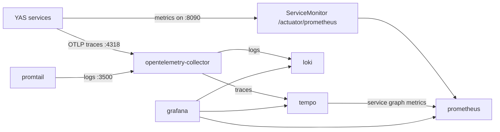

# Kubernetes Observability Stack

The YAS Kubernetes observability stack is installed from `k8s/deploy/setup-cluster.sh` into the `observability` namespace. It is based on OpenTelemetry Collector, Prometheus, Grafana, Loki, Tempo, and Promtail.

## Components

- `opentelemetry-collector`: Receives OTLP traces from YAS services and Loki-format logs from Promtail. It batches and forwards traces to Tempo and logs to Loki.
- `prometheus`: Installed by `kube-prometheus-stack`. It stores metrics scraped from YAS service `ServiceMonitor` resources and receives Tempo-generated trace metrics.
- `grafana`: Installed by `kube-prometheus-stack` and managed through Grafana Operator datasource/dashboard CRs.
- `loki`: Stores application logs.
- `tempo`: Stores distributed traces and generates service graph metrics for Prometheus.
- `promtail`: Collects pod logs and sends them to the OpenTelemetry Collector Loki receiver.

## Telemetry Flow



## Install

From `k8s/deploy`:

```bash
./setup-cluster.sh
```

The script installs the observability components in this order:

- `loki` from `grafana/loki`
- `tempo` from `grafana/tempo`
- `opentelemetry-operator`
- `opentelemetry-collector` from `observability/opentelemetry`
- `promtail` from `grafana/promtail`
- `prometheus` and built-in Grafana from `kube-prometheus-stack`
- Grafana Operator resources from `observability/grafana`

## Important Configuration

- YAS services expose metrics on the `metric` service port and are discovered by `k8s/charts/backend/templates/servicemonitoring.yaml`.
- YAS traces are sent to `http://opentelemetry-collector.observability:4318/v1/traces` from `k8s/charts/yas-configuration/values.yaml`.
- Promtail sends logs to `http://opentelemetry-collector:3500/loki/api/v1/push`.
- Grafana is exposed at `grafana.<domain>`, where `<domain>` comes from `k8s/deploy/cluster-config.yaml`.

## Quick Checks

```bash
kubectl get pods -n observability
kubectl get servicemonitor -n yas
kubectl get grafanadatasource -n observability
kubectl logs -n observability deploy/opentelemetry-collector
```

In Grafana:

- Use Prometheus for metrics.
- Use Loki for logs, filtered by namespace, pod, container, or trace ID.
- Use Tempo for traces and node graph/service graph views.
