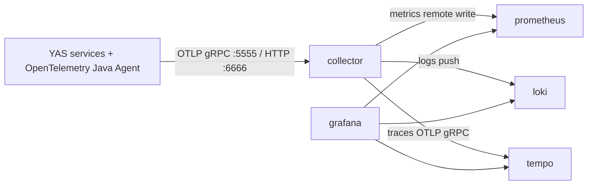

# Observability Stack

The local observability stack is defined in `docker-compose.o11y.yml`. It receives telemetry from the YAS services through the OpenTelemetry Java Agent and makes metrics, traces, and logs available in Grafana.

## Components

- `collector`: OpenTelemetry Collector. Receives OTLP telemetry from services, batches and transforms it, then exports data to the matching backend.
- `prometheus`: Metrics storage. Receives application metrics through remote write and scrapes the observability components.
- `grafana`: Dashboard UI. Provisions Prometheus, Tempo, and Loki datasources automatically.
- `loki`: Log storage. Stores logs exported by the collector.
- `tempo`: Distributed trace storage. Stores OTLP traces and supports Grafana trace lookup.

## Telemetry Flow



## Run Locally

Start only the observability services:

```bash
docker compose -f docker-compose.o11y.yml up -d
```

Start the full local stack, using the `COMPOSE_FILE` value from `.env`:

```bash
docker compose up -d
```

Useful local endpoints:

- Grafana: http://localhost:3000
- Prometheus: http://localhost:9090
- Loki: http://localhost:3100
- Tempo: http://localhost:3200
- Collector OTLP gRPC: http://localhost:5555
- Collector OTLP HTTP: http://localhost:6666

The Java services already read these variables from `.env`:

```env
OTEL_EXPORTER_OTLP_ENDPOINT=http://collector:5555
OTEL_EXPORTER_OTLP_PROTOCOL=grpc
OTEL_LOGS_EXPORTER=otlp
OTEL_TRACES_EXPORTER=otlp
OTEL_METRICS_EXPORTER=otlp
```

## Quick Checks

```bash
docker compose -f docker-compose.o11y.yml ps
docker compose -f docker-compose.o11y.yml logs collector
```

In Grafana, open the provisioned datasources and dashboards. Metrics should appear in Prometheus, traces in Tempo, and logs in Loki after at least one YAS service sends telemetry.
